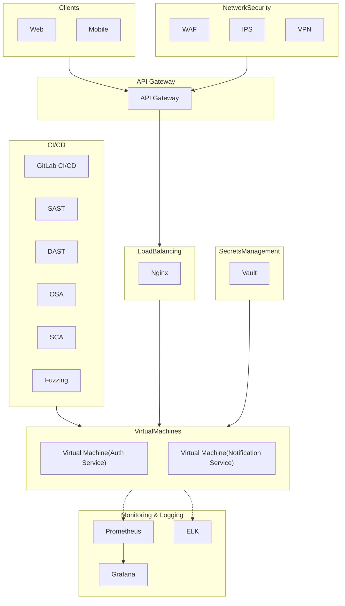

# Блок схема

```mermaid
flowchart TD
    subgraph Clients
        direction TB
        Web["Web"]
        Mobile["Mobile"]
    end

    subgraph API Gateway
        direction TB
        APIGateway["API Gateway"]
    end
    
    subgraph LoadBalancing
        direction TB
        NLB["Nginx"]
    end
    
    subgraph VirtualMachines
        direction TB
        VM1["Virtual Machine(Auth Service)"]
        VM2["Virtual Machine(Notification Service)"]
    end
    
    subgraph Monitoring & Logging
        direction TB
        Prometheus["Prometheus"]
        Grafana["Grafana"]
        ELKStack["ELK"]
    end
    
    subgraph CI/CD
        direction LR
        GitLabCI["GitLab CI/CD"]
        SAST["SAST"]
        DAST["DAST"]
        OSA["OSA"]
        SCA["SCA"]
        Fuzzing["Fuzzing"]
    end
    
    subgraph SecretsManagement
        direction TB
        Vault["Vault"]
    end
    
    subgraph NetworkSecurity
        direction TB
        WAF["WAF"]
        IPS["IPS"]
        VPN["VPN"]
    end
    
    Clients --> APIGateway
    APIGateway --> LoadBalancing
    CI/CD --> VirtualMachines
    LoadBalancing --> VirtualMachines
    VirtualMachines -.-> Prometheus
    Prometheus --> Grafana
    VirtualMachines -.-> ELKStack
    SecretsManagement --> VirtualMachines
    NetworkSecurity --> APIGateway
```
