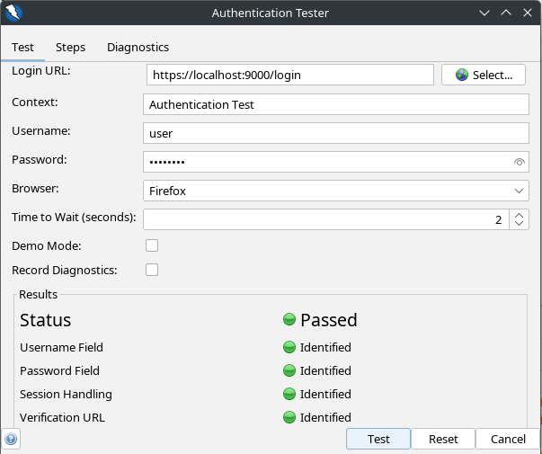
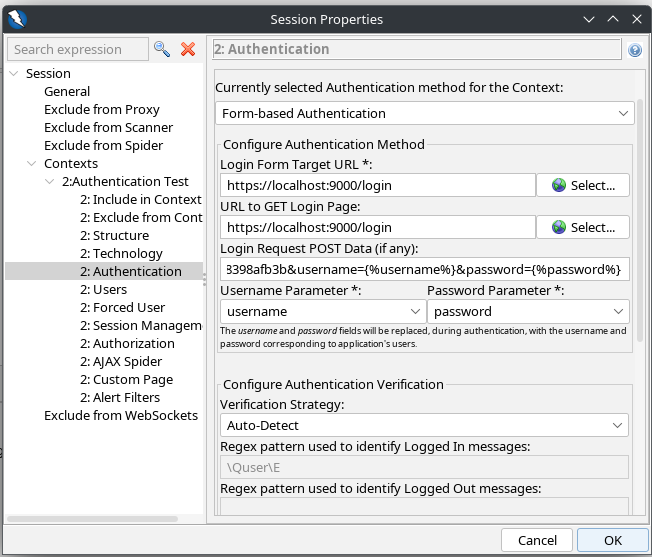
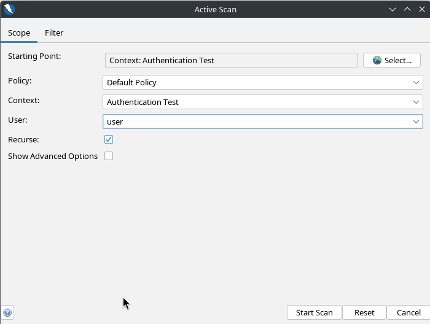
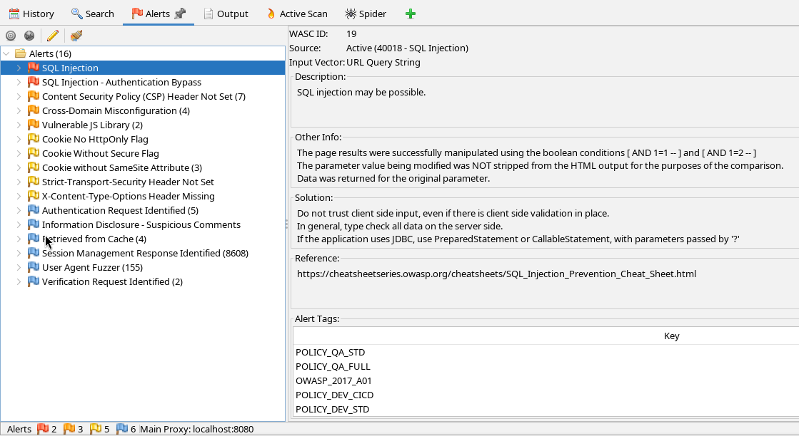

# Использование динамического анализатора безопасности приложений (DAST)

## Цель: Научиться устанавливать и использовать open-source DAST для анализа веб-приложений, различать ложные срабатывания и реальные уязвимости.

### 1: Выбор и установка DAST инструмента

В качестве DAST выбран инструмент OWASP ZAP, одним из самых популярных open-source решений для динамического анализа безопасности веб-приложений.

Для начала скачаем анализтор с официального сайта `https://www.zaproxy.org/download/`
Т.к. мы используем linux установка будет выглядеть следующим образом:

```bash
chmod +x ~/Downloads/ZAP_2_16_0_unix.sh
sudo ~/Downloads/ZAP_2_16_0_unix.sh
```

После установки и запуска ZAP запустит прокси на адресе `127.0.0.1:8080`

### Шаг 2: Выбор веб-приложения для анализа

Для анализа выберем приложение JavaSpringVulny. Которе изначально содержит уязвимости и подходит для изучения возможностей OWASP ZAProxy.

Для запуска приложения склонируем исходный код на локальный компьютер, соберём и запустим docker контейнер

```bash
git clone https://github.com/kaakaww/javaspringvulny.git
cd ./javaspringvulny
docker compose build
docker compose up -d
```

После запуска контейнера приложение будет доступно по адресу: `https://localhost:9000`

1. Запускаем OWASP ZAProxy и переходим к пункту меню «Быстрый старт» («Quick Start»).
2. Выбераем режим «Автоматизированное сканирование» («Automated Scan»).
3. Вводим URL нашего веб-приложения `https://localhost:9000/login` в поле «URL to attack» 
4. Проверка аутентификации
    -> Tools -> Authentication Tester

```json
Login URL: https://localhost:9000/login
username: user
password: password
```

Все тесты должны завершиться успешно

5. Заполним параметра Authentication на основании данных полученных на шаге 5

6. Запускаем Active Scan и выбираем контекст, созданный на шаге 4



ZAP начнет автоматическое сканирование, используя активные и пассивные методы анализа.
После завершения сканирования просмотрите результаты в разделе "Alerts".



### Шаг 3: Анализ результатов сканирования

ZAP обнаружил возможность внедрения SQL-кода в поле ввода на странице входа.
Это критическая уязвимость, так как злоумышленник может получить несанкционированный доступ к базе данных.
Последствия: Утечка данных, удаление или изменение данных в базе.
Рекомендации: Использовать параметризованные запросы и ORM для предотвращения SQL-инъекций.
